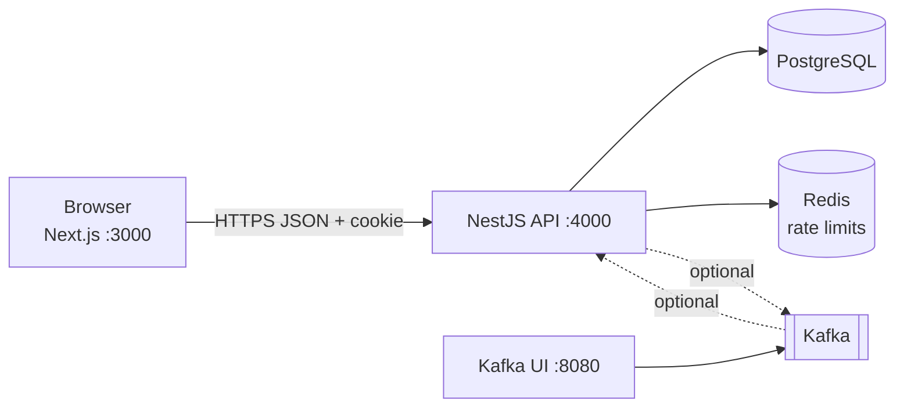
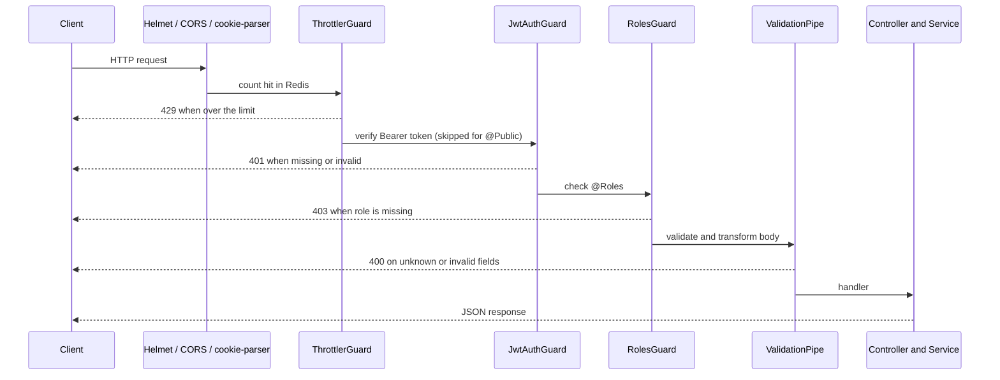
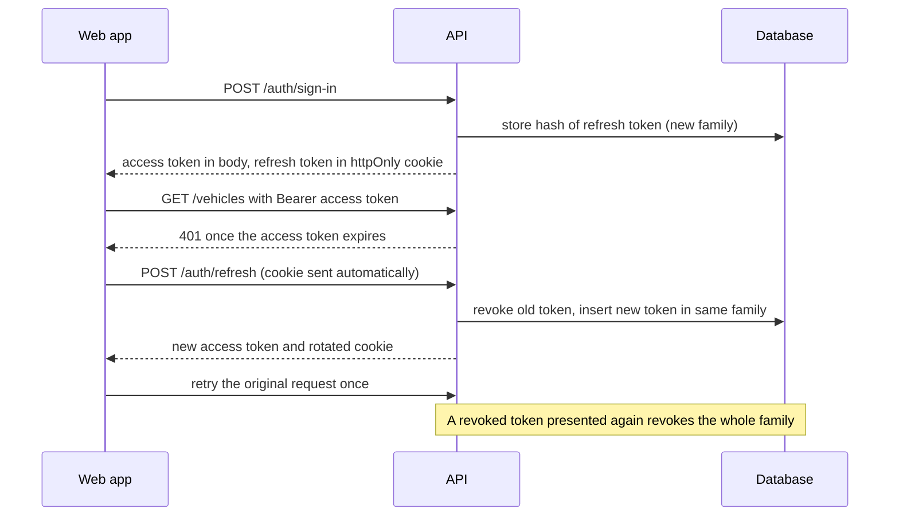

# Architecture overview

A pnpm monorepo with two apps and local infrastructure. Decisions are recorded in [../adr](../adr).



Apps run on the host; Docker Compose only runs PostgreSQL, Redis, Kafka and Kafka UI.

## API modules

```
apps/api/src
├── main.ts, setup-app.ts      bootstrap and HTTP setup shared with e2e tests
├── app.module.ts              wires modules and global guards
├── common/                    guards, decorators, pagination, db error helper
├── infrastructure/
│   ├── config/                env validation (fails fast), root .env loader
│   ├── database/              TypeORM options, CLI data source, migrations, seed
│   ├── cache/                 Redis client, Redis-backed throttler storage
│   ├── logging/               pino setup and redaction list
│   └── messaging/             EventPublisher port, Kafka and no-op adapters
├── health/                    /api/health/live, /api/health/ready (database, Redis)
└── modules/
    ├── auth/                  sign-up, sign-in, refresh, logout, me
    ├── users/entities/        User entity (owned by auth for now)
    └── vehicles/              example CRUD, publishes vehicle.created
```

## Request flow



Routes live under `/api` with URI version `v1` (for example `/api/v1/vehicles`). `/api/health/live` and `/api/health/ready` are
version neutral. Swagger UI is at `/api/docs`.

## Authentication flow



See [ADR 0002](../adr/0002-auth-refresh-rotation.md) for the reasoning and its limits.

## Web app

`apps/web` is a Next.js App Router app. Pages are client components behind an `AuthProvider`; the
access token lives in memory inside `lib/api-client.ts`, which also retries a request once after a
refresh and shares a single refresh between parallel requests.
